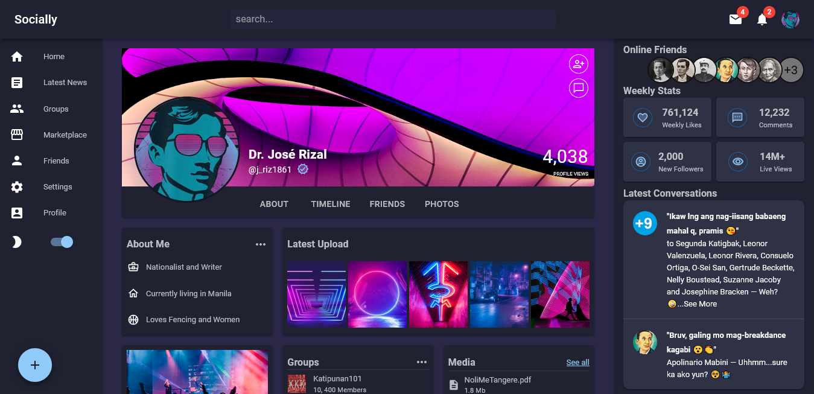

# Socially
  -Live Site URL: [https://socially-finch.netlify.app/](https://socially-finch.netlify.app/)

  -This react app is a showcase of my understanding of Material UI.
  
## Table of contents

- [Overview](#overview)
  - [Screenshot](#screenshot)
  - [Links](#links)
- [My Process](#process)
  - [Install Dependencies](#dependencies)
  - [Additional Info](#additional-info)
  - [Built With](#built-with)
- [Author](#author)

## Overview

### Screenshot



### Links

- Live Site URL: [https://socially-finch.netlify.app/](https://socially-finch.netlify.app/)

## My Process

### Install Dependencies

```js
yarn add @mui/material @emotion/react @emotion/styled
yarn add @mui/icons-material
```

### Additional Info
1. Add the codes inside **index.html** :

     ```html
          <link
          rel="stylesheet"
          href="https://fonts.googleapis.com/css?family=Roboto:100,200,300,400,500,700&display=swap"
          />
          <style>
               * {
               font-family: "Roboto", sans-serif;
               margin: 0;
               }
          </style>
     ```

---

### Built with

- Semantic HTML5 markup
- CSS custom properties
- Material UI
- ReactJS
- Vite

---
 
## Author

- Twitter - [@julfinch](https://www.twitter.com/julfinch)
